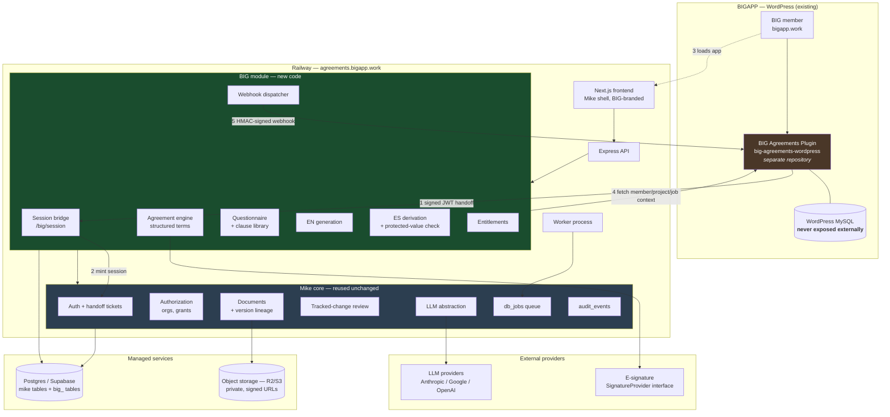
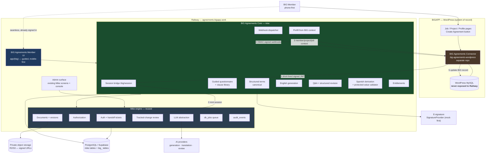

# ARCHITECTURE_PROPOSAL.md — BIG Agreements

**Status:** Proposal for approval. Nothing here has been implemented.
**Companion documents:** `REPO_AUDIT.md`, `IMPLEMENTATION_PLAN.md`

---

## 1. The central decision: separate service, or module inside the fork?

This is the question that determines everything else, so it is answered first.

### The three options

**Option A — Modify Mike in place.**
Add agreement logic directly into `routes/projects.ts`, `documents.ts`, the chat
tools, and existing tables. Fastest to a demo; worst long-term. Every upstream
security fix becomes a merge conflict, and the 288-test suite fights every
change. **Rejected.**

**Option B — A fully separate BIG Agreements service that calls Mike over HTTP.**
Two deployables, two repos, clean conceptual separation.

The problem is what BIG Agreements actually needs from Mike. It is not a thin
consumer of Mike's features — it needs Mike's *internals*: document versioning,
tracked-change edit review, object storage keys, the LLM abstraction, the job
queue, and the same user identity. Mike exposes none of that as a
service-to-service API; **every endpoint is end-user session-scoped, and there
is no machine auth anywhere in the codebase** (`REPO_AUDIT.md` §14).

So Option B means either building a substantial new S2S API surface across
Mike's internals — which is *more* invasive editing of upstream files than
Option C — or duplicating storage, document and LLM layers in the new service
and leaving Mike as a mostly-unused shell. Plus a second deploy, a second set of
secrets, cross-service transactions, and network latency inside a single user
interaction.

**Option C — An isolated module inside this fork. ✅ Recommended.**
One deployable. BIG code lives in new files under a `big/` namespace, owns its
own `big_*` tables, and mounts its own `/big/*` API. It calls Mike's libraries
directly as in-process function calls — `lib/storage.ts`, `lib/llm`,
`lib/dbq`, `lib/documentVersions.ts` — rather than over HTTP.

### Recommendation

> **Separate BIG Agreements logically, not physically.**
> A distinct module, a distinct schema namespace, a distinct API namespace, and
> a genuinely separate WordPress plugin repository — all inside one deployed
> application.

This gives the isolation you are asking for (BIG code is identifiable,
self-contained, and reviewable on its own) without paying for a network boundary
in the middle of a single feature.

### Why this is safe rather than a compromise

The isolation is enforced by rules, not by hope:

1. **New files only.** BIG code lives in `backend/src/big/**` and
   `frontend/src/app/(big)/**`.
2. **Two distinct classes of upstream touch**, and they must not be conflated:
   - **Logic seams — target under ten files.** Each is a one-line mount or
     delegation, never behaviour: `backend/src/app.ts` (one
     `app.use("/big", bigRouter)`), `backend/src/lib/authHandoff.ts`
     (generalise the origin gate).
   - **Branding literal → config reads.** Necessarily wider (Phase 1 touched
     ~30 files), but every one replaces a hardcoded string with a
     configuration read and changes no behaviour. Every one is enumerated in
     `docs/UPSTREAM_SYNC.md`.

   Product branding deliberately lives in `backend/src/lib/branding.ts` and
   `frontend/src/app/lib/branding.ts` — **not** under `big/`. It is product
   configuration that upstream files legitimately read; filing it as BIG
   domain code would force the dependency rule below to ship with an
   exemption on day one.
3. **Own tables, `big_` prefixed.** Zero changes to upstream table definitions;
   new migrations only add new objects.
4. **A one-way dependency rule.** BIG code may import Mike libraries. Mike code
   may never import BIG code. Enforced in CI by
   `scripts/check-module-boundaries.sh`
   (`.github/workflows/big-module-boundaries.yml`).

### The escape hatch

Because the module is already isolated behind `big_*` tables and a `/big/*` API,
extracting it into its own service later is a contained refactor rather than an
archaeology project. Take the split when there is a concrete reason —
independent scaling, a separate compliance boundary, or a decision to drop Mike
— not on day one, when the cost is certain and the benefit is speculative.

### What *is* separate from day one

The **WordPress plugin** (`big-agreements-wordpress`) is a separate repository,
separate deployable, separate lifecycle, and communicates only over HTTP. This
is both good engineering and the safer AGPL posture (`REPO_AUDIT.md` §16).

---

## 2. System topology



**No direct WordPress-MySQL access from Railway.** All BIGAPP data crosses the
boundary through the plugin's authenticated REST API.

---

## 3. Identity and session handoff

Upstream already ships the hard part. `lib/authHandoff.ts` issues single-use,
AES-256-GCM-encrypted, 30–300 second session tickets bound to
`user_id + ticket_hash + request_id + origin`, stored only as a hash. The Word
add-in has used it in production. It is currently gated to the Word add-in
origin (`requestOriginIsWordAddin`) — that gate becomes a small allowlist rather
than a single origin.

**Proposed flow:**

1. Member opens `bigapp.work/agreements/`.
2. The plugin mints a short-lived **RS256 or HS256 JWT** (≤120s, `jti` for
   replay protection) carrying only: WP user id, display name, membership tier,
   entitlements, roles, and the current project/job/company ids.
3. Plugin POSTs it to `POST /big/session` on Railway.
4. The session bridge verifies signature, `iat`/`exp`, `jti` (single use), and
   issuer, then resolves or **just-in-time provisions** the matching Supabase
   user, mapping the BIG company to a Mike `organization`.
5. Backend issues a normal Mike session and returns a handoff ticket.
6. Member's browser is redirected to `agreements.bigapp.work` with the ticket
   and exchanges it for HttpOnly cookies.

No second login. No WordPress credentials leave WordPress. No long-lived shared
secret in the browser.

**Key management:** asymmetric (WordPress signs with a private key, Railway
verifies with the public key) is preferred — it means Railway holds no secret
capable of minting BIG identities.

---

## 4. Embedding: subdomain first, not iframe

Mike sets `frame-ancestors 'none'` (`app.ts`). Relaxing it is a deliberate
clickjacking trade-off.

**Recommendation for Phase 1: a seamless subdomain**
(`agreements.bigapp.work`), reached from WordPress via the session handoff. The
member clicks *Create Agreement* in BIGAPP, lands already signed in, and sees BIG
branding throughout. No CSP relaxation, no third-party-cookie fragility, no
iframe focus and scroll problems inside a document editor.

If BIG later requires true in-page embedding, relax `frame-ancestors` to exactly
`https://bigapp.work` — never a wildcard — and add `X-Frame-Options` handling,
partitioned-cookie (CHIPS) support, and a clickjacking review. Treat that as its
own scoped piece of work.

---

## 5. Agreement data model

New `big_`-prefixed tables. RLS enabled, no policies — matching the existing
codebase contract (`REPO_AUDIT.md` §5).

```
big_agreements
  id, uuid, org_id → organizations, project_id → projects
  big_user_id, big_project_id, big_job_id, big_company_id   -- external refs
  agreement_type, jurisdiction_country, jurisdiction_state
  status, structured_terms jsonb
  created_by, created_at, updated_at

big_agreement_parties
  agreement_id, role (client|contractor|subcontractor|vendor|witness)
  display_name, company, email, big_user_id, resolved_user_id

big_agreement_versions
  agreement_id, language ('en'|'es'), version_number
  source_version_id            -- ES v2 → EN v2 lineage
  document_id → documents      -- reuses Mike storage + versioning
  structured_terms_snapshot jsonb, content_sha256
  sync_status (current|outdated|regenerating)
  generated_at, model_used, token_cost

big_agreement_definitions      -- typed questionnaire + clause composition
big_clauses                    -- clause library, versioned
big_agreement_events           -- domain audit, complements audit_events
big_webhook_deliveries         -- outbound delivery log
big_entitlement_usage          -- metering
```

**Deliberate reuse:** each version's rendered document is a normal Mike
`documents` + `document_versions` row. Storage, signed URLs, conversion,
retention and tracked-change review all come free.

`structured_terms` is the canonical contract data. Documents are renditions of
it — never the source of truth.

---

## 6. English-first, Spanish-derived

```
structured_terms (canonical)
        ↓ generate
EN v1 ──────────────────────────► member review / Q&A / revision
        ↓ member confirms revision
EN v2  ⟶ marks ES v1 sync_status = 'outdated'
        ↓ "Would you also like a Spanish version?"
ES v2  ── derived FROM EN v2, source_version_id = EN v2
        ↓
protected-value validation gate
```

Spanish is never generated from the questionnaire. `source_version_id` makes
lineage a database constraint rather than a convention.

**Protected-value validation** must not be an LLM self-assessment. Extract
names, companies, addresses, dates, amounts, currencies, percentages, defined
terms and section numbering from *both* documents deterministically, diff them,
and fail the translation on mismatch. The LLM proposes; the validator decides.

---

## 7. Revision as a structured operation

When a member says *"change the deposit from 50% to 25%"*, the system must not
simply reply in prose. The flow is:

1. Classify: question (answer it) vs. change request (act on it).
2. Map the request onto specific `structured_terms` fields and clauses.
3. Present a concrete diff for confirmation.
4. On confirmation, write new `structured_terms`, create a new EN version, mark
   any ES version outdated, and re-render the document.
5. Record a `big_agreement_events` row.

Mike's existing `document_edits` accept/reject machinery covers the
document-level review UI; the structured-field mapping is the new part.

---

## 8. Webhooks

Nothing exists upstream, but `db_jobs` — the durable Postgres queue with
attempts, statuses and retry semantics — is the right substrate. No new
infrastructure needed.

Per delivery: unique event id, timestamp, HMAC-SHA256 signature over
`timestamp + body`, exponential backoff, idempotency key, and a
`big_webhook_deliveries` audit row.

Payloads carry **ids and metadata only** — never contract bodies. The plugin
calls back for anything it needs.

Events: `agreement.created`, `.generated`, `.updated`,
`.translation.generated`, `.translation.outdated`, `.finalized`,
`.sent_for_signature`, `.signed`, `.cancelled`.

---

## 9. Railway topology

| Service | Notes |
| --- | --- |
| `api` | Express. `backend/Dockerfile` (LibreOffice included). Healthcheck `/health` — already exists. |
| `worker` | Same image, `WORKERS_MODE` worker entrypoint. Split out only when generation load justifies it. |
| `frontend` | Next.js via `frontend/Dockerfile`. **Not** the OpenNext/Cloudflare path. |
| Postgres | Supabase Cloud strongly preferred — Mike depends on GoTrue, not just Postgres. Self-hosting the full Supabase stack on Railway is possible but is a significant separate undertaking. |
| Redis | **Optional.** Set `QUEUE_DRIVER` to the Postgres `db_jobs` queue and omit Redis entirely in Phase 1. |
| Object storage | Cloudflare R2 (or S3). **Never Railway's ephemeral disk.** |

Environments: `local` (Docker Compose, unchanged) → `staging-agreements.bigapp.work`
→ `agreements.bigapp.work`.

Upstream already ships `nixpacks.toml` and `railpack.json` with LibreOffice
configured — Railway deployment is a trodden path here, not an experiment.

---

## 10. Branding configuration

One module, not scattered string replacement:

```
PRODUCT_NAME, PRODUCT_LOGO, PRODUCT_FAVICON, SUPPORT_EMAIL,
PRIMARY_BRAND, LEGAL_FOOTER, PUBLIC_APP_URL, OPEN_SOURCE_NOTICE_URL
```

Member-facing surfaces read from this config. Internal identifiers
(`MikeApiError`, `mike_workflows`, the storage bucket name) stay as they are —
renaming them buys nothing and costs merge conflicts on every upstream sync.

`OPEN_SOURCE_NOTICE_URL` is not optional: AGPL §13 obliges us to offer source to
network users, and no such notice exists today (`REPO_AUDIT.md` §16).

---

## 11. Repository strategy — recommendation

**Option B from your brief, with one adjustment.** Keep this renamed fork as
`BIG-R-D/BIGAgreements` and add `BIG-R-D/big-agreements-wordpress`. Do not create
a third `big-agreements-core` repository — splitting core from the fork now
produces exactly the duplication problem described in §1.

Remotes are already correct:

```
origin    https://github.com/BIG-R-D/BIGAgreements.git
upstream  https://github.com/open-legal-products/mike.git
```

**Upstream sync policy:** never merge blindly. Fetch upstream, review the
changelog, cherry-pick security and dependency fixes, evaluate feature commits
on their merits. The isolation rules in §1 are what keep this cheap. Document
the procedure in `docs/UPSTREAM_SYNC.md`.

---

## 12. Open questions requiring BIG input

1. **BIGAPP's WordPress schema is unknown.** Which plugins hold member, project,
   job and company records? Nothing should be built against assumed schemas —
   hence the adapter layer (`MemberAdapter`, `ProjectAdapter`, `JobAdapter`,
   `CompanyAdapter`).
2. **Supabase Cloud or self-hosted?** This materially changes Railway topology.
3. **Contractor/client visibility rules.** Who sees a draft before signature?
   Mike's model assumes collaborators, not counterparties.
4. **LLM provider and data-retention terms** for contract content.
5. **Does BIG intend to publish modified source to members** (AGPL §13)?
6. **E-signature vendor** — the interface is vendor-neutral, but Phase 1 ships a
   mock adapter until this is decided.

---

# Addendum — member product architecture

Added after the expanded product brief. Section 1's module-vs-service
recommendation is unchanged. What follows addresses the **product surface**,
which the original proposal did not cover.

## 13. Member UI: build new, do not adapt

`REPO_AUDIT.md` §21–23 establishes that Mike's screens are lawyer-oriented and
its list/table patterns break on a phone. Three options:

**A — Re-skin existing screens.** Rejected. The information architecture is the
problem, not the styling. It also maximises upstream merge pain, because every
adapted screen is a file we then fight over on every sync.

**B — New member surface beside the existing app. ✅ Recommended.**
A new route group `frontend/src/app/(big)/` with its own layout, navigation and
mobile-first components, calling `/big/*` endpoints. Mike's existing screens
remain untouched at their current routes and become the **admin** surface
(Mode 3). Zero upstream screens modified; zero merge cost.

**C — Separate SPA.** Rejected for Phase 2 — a second frontend to deploy,
authenticate and maintain, for no gain over B.

**Routing consequence:** members land on `/(big)` routes and never see
`/assistant`, `/library`, `/tabular-reviews`, `/workflows`. Those remain
reachable for BIG staff. Enforcement is server-side by role, not by hiding nav
links.

## 14. The three modes, concretely

| Mode | Entry | Surface | Auth |
| --- | --- | --- | --- |
| **1 Member** | `bigapp.work` → handoff → `/(big)` | New guided surface, mobile-first | WordPress JWT → handoff ticket → Supabase session |
| **2 Counterparty** | Emailed signed link | Single agreement, read/comment/sign only | Scoped, tokenised, **no account** — new build |
| **3 Admin** | Direct login at `agreements.bigapp.work` | Existing Mike screens + new admin console | Normal Supabase session + org admin role |

Mode 2 is the largest security-sensitive gap: Mike has **no concept of an
account-less participant**, and its sharing model requires an existing user
profile. Defer past the first slice, but do not model agreement parties in a way
that makes it hard later — hence `big_agreement_parties` carrying identity
*before* any user account exists.

## 15. System topology



## 16. Prefill and the data boundary

WordPress stays authoritative for members, companies, jobs, projects and
membership. BIG Agreements stays authoritative for agreements, structured terms,
versions, translation lineage and agreement audit history.

Agreements reference BIG records by **stable external id only**
(`external_big_user_id`, `external_big_project_id`, `external_big_job_id`,
`external_big_company_id`) — no mirroring of the BIG database.

Prefill is a **read-through at agreement-creation time**: the core calls the
connector, populates `structured_terms`, and snapshots the values into the
agreement so a later change in WordPress cannot silently rewrite an executed
contract. The snapshot is the legally meaningful record; the live BIG record is
only the source for the initial fill.

## 17. Plain-language layer

The questionnaire carries two labels per field: a member-facing question
("Who is responsible if someone causes damage or a claim?") and the legal
concept it populates (`indemnification`). The document generator uses the legal
concept; the UI only ever shows the plain-language one. This keeps the
translation from member language to contract language in **data**, not in
scattered UI copy — and makes Spanish member-facing copy a second column rather
than a second UI.

## 18. First agreement type — noted disagreement, deferring to BIG

The brief selects the **Subcontractor Agreement**, and that is what will be
built. Recording the earlier reasoning once, then proceeding:

An Independent Contractor Agreement exercises the same machinery (prefill,
questionnaire, generation, Q&A, revision, translation, webhook) with materially
less jurisdictional surface — no lien waivers, retainage, flow-down clauses,
bonding or insurance-certificate handling. Those are the parts most likely to
need real legal review, and debugging a new engine underneath them is slower.

BIG's rationale — that the subcontractor relationship is the core construction
relationship and exercises the full clause set — is sound, and the decision is
BIG's to make. Proceeding with Subcontractor. The mitigation is to treat clause
content as a legal-review deliverable tracked separately from engine work, so a
clause-wording question never blocks the pipeline.
